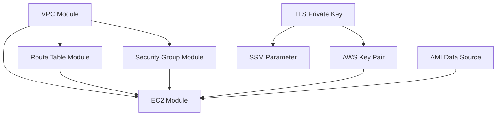

# NT542.Q11 Terraform Lab - Hướng dẫn triển khai Infrastructure trên AWS

Dự án Terraform chuyên nghiệp để tạo infrastructure trên AWS theo best practices, bao gồm VPC, Subnets, Internet Gateway, Route Table, Security Group và EC2 Instance với SSH Key management tự động.

## 🏗️ Kiến trúc Infrastructure

```
┌─────────────────────────────────────────────────────────┐
│                    AWS Region (us-east-1)              │
│ ┌─────────────────────────────────────────────────────┐ │
│ │              VPC (10.25.0.0/16)                     │ │
│ │ ┌─────────────────────────────────────────────────┐ │ │
│ │ │     Public Subnet (10.25.0.0/24)               │ │ │
│ │ │ ┌─────────────────┐  ┌─────────────────────┐   │ │ │
│ │ │ │   EC2 Instance  │  │   Security Group    │   │ │ │
│ │ │ │   (Web Server)  │  │ - SSH (22)          │   │ │ │
│ │ │ │   + Apache      │  │ - HTTP (80)         │   │ │ │
│ │ │ │   + Auto SSH    │  │ - HTTPS (443)       │   │ │ │
│ │ │ └─────────────────┘  └─────────────────────┘   │ │ │
│ │ └─────────────────────────────────────────────────┘ │ │
│ │              │                                      │ │
│ │    ┌─────────┴──────────┐                          │ │
│ │    │    Route Table     │                          │ │
│ │    │  0.0.0.0/0 → IGW   │                          │ │
│ │    └────────────────────┘                          │ │
│ └─────────────────────────────────────────────────────┘ │
│                        │                               │
│              ┌─────────┴─────────┐                     │
│              │  Internet Gateway │                     │
│              └───────────────────┘                     │
└─────────────────────────────────────────────────────────┘
                         │
                    ┌────┴────┐
                    │ Internet │
                    └─────────┘
```

## 📁 Cấu trúc dự án

```
NT542.Q11-Terraform-Lab/
├── README.md                           # Tài liệu hướng dẫn (file này)
├── core/                              # Core Terraform configuration
│   ├── provider.tf                    # AWS & TLS provider configuration
│   ├── variables.tf                   # Input variables definition
│   ├── networking.tf                  # VPC, Subnets, Route Tables
│   ├── security_groups.tf            # Security Groups configuration
│   ├── ec2.tf                        # EC2 instances & SSH keys
│   ├── outputs.tf                    # Output values
│   └── lab.tfvars                    # Environment-specific variables
└── modules/                          # Reusable Terraform modules
    ├── aws-vpc-with-subnets/         # VPC module
    │   ├── main.tf
    │   ├── variables.tf
    │   ├── outputs.tf
    │   └── README.md
    ├── aws-ec2/                      # EC2 module
    │   ├── main.tf
    │   ├── variables.tf
    │   ├── outputs.tf
    │   └── README.md
    ├── aws-security-groups/          # Security Groups module
    │   ├── main.tf
    │   ├── variables.tf
    │   ├── outputs.tf
    │   └── README.md
    └── aws-route-table/              # Route Table module
        ├── main.tf
        ├── variables.tf
        ├── outputs.tf
        └── README.md
```

## 🚀 Infrastructure được tạo

### 1. Network Layer
- **VPC**: Virtual Private Cloud với CIDR `10.25.0.0/16`
- **Public Subnet**: `10.25.0.0/24` trong Availability Zone `us-east-1a`
- **Internet Gateway**: Kết nối VPC với Internet
- **Route Table**: Định tuyến traffic từ subnet ra Internet

### 2. Security Layer
- **Security Group**: Kiểm soát traffic với các rules:
  - **SSH (Port 22)**: Truy cập quản trị từ mọi nơi
  - **HTTP (Port 80)**: Web traffic
  - **HTTPS (Port 443)**: Secure web traffic
  - **Outbound**: Cho phép tất cả traffic ra ngoài

### 3. Compute Layer
- **EC2 Instance**: Amazon Linux 2023 (t3.micro)
- **Web Server**: Apache HTTP Server được cài đặt tự động
- **SSH Key Pair**: Tự động tạo và quản lý an toàn

### 4. Security & Key Management
- **TLS Private Key**: RSA 4096-bit key được tạo tự động
- **AWS Key Pair**: Quản lý SSH access
- **SSM Parameter Store**: Lưu trữ private key an toàn

## 🧩 Chi tiết Modules Architecture

### 1. Module `aws-vpc-with-subnets`

**Mục đích**: Tạo VPC với subnets và các components network cơ bản

**Resources được tạo**:
```hcl
# VPC chính với DNS support
resource "aws_vpc" "main" {
  cidr_block           = var.cidr_block
  enable_dns_support   = true
  enable_dns_hostnames = false
  instance_tenancy     = "default"
}

# Default Security Group (bảo mật - không có rules)
resource "aws_default_security_group" "this" {
  vpc_id = aws_vpc.main.id
  # Không có ingress/egress rules - security by default
}

# Default Route Table (không có routes)
resource "aws_default_route_table" "this" {
  default_route_table_id = aws_vpc.main.default_route_table_id
}

# Dynamic Subnets từ map configuration
resource "aws_subnet" "this" {
  for_each = var.subnets
  
  vpc_id                  = aws_vpc.main.id
  cidr_block             = each.value.cidr_block
  availability_zone      = each.value.availability_zone
  map_public_ip_on_launch = each.value.map_public_ip_on_launch
}

# Internet Gateway cho internet connectivity
resource "aws_internet_gateway" "this" {
  vpc_id = aws_vpc.main.id
}
```

**Input Variables**:
- `cidr_block`: VPC CIDR (ví dụ: "10.25.0.0/16")
- `prefix_name`: Prefix cho naming convention
- `subnets`: Map object chứa subnet configurations
- `tags`: Common tags cho tất cả resources

**Outputs**:
- `id`: VPC ID
- `arn`: VPC ARN
- `subnet_id`: Map of subnet IDs
- `subnet_arn`: Map of subnet ARNs
- `igw_id`: Internet Gateway ID

**Cách sử dụng trong core**:
```hcl
module "vpc" {
  source = "../modules/aws-vpc-with-subnets"
  
  cidr_block  = var.vpc_cidr_block
  subnets     = var.vpc_subnets
  prefix_name = "vpc-${var.environment}-${var.project_name}"
  
  tags = {
    Environment = var.environment
    Project     = var.project_name
    createvia   = "terraform"
  }
}
```

### 2. Module `aws-route-table`

**Mục đích**: Quản lý route tables và associations một cách linh hoạt

**Resources được tạo**:
```hcl
# Route Table với custom name
resource "aws_route_table" "main" {
  vpc_id = var.vpc_id
  tags = merge(var.tags, { Name = var.name })
}

# Dynamic Routes từ map configuration
resource "aws_route" "this" {
  for_each = var.routes
  
  route_table_id         = aws_route_table.main.id
  destination_cidr_block = each.value.destination_cidr_block
  gateway_id             = each.value.gateway_id
  nat_gateway_id         = each.value.nat_gateway_id
  # ... các options khác
}

# Route Table Associations
resource "aws_route_table_association" "this" {
  for_each = var.route_table_associations
  
  route_table_id = aws_route_table.main.id
  subnet_id      = each.value.subnet_id
  gateway_id     = each.value.gateway_id
}
```

**Input Variables**:
- `name`: Route table name
- `vpc_id`: VPC ID để attach route table
- `routes`: Map object chứa route configurations
- `route_table_associations`: Map object chứa association configs
- `tags`: Resource tags

**Cách sử dụng trong core**:
```hcl
module "public_route_table" {
  source = "../modules/aws-route-table"
  
  name   = "rtb-public-${var.environment}-${var.project_name}"
  vpc_id = module.vpc.id
  
  routes = {
    "internet_route" = {
      destination_cidr_block = "0.0.0.0/0"
      gateway_id             = module.vpc.igw_id
    }
  }
  
  route_table_associations = {
    for subnet_name, subnet_config in var.vpc_subnets : subnet_name => {
      subnet_id = module.vpc.subnet_id[subnet_name]
    }
  }
}
```

### 3. Module `aws-security-groups`

**Mục đích**: Tạo Security Groups với ingress/egress rules linh hoạt

**Resources được tạo**:
```hcl
# Security Group chính
resource "aws_security_group" "main" {
  name                   = var.name
  description            = var.description
  vpc_id                 = var.vpc_id
  revoke_rules_on_delete = var.revoke_rules_on_delete
}

# Dynamic Egress Rules
resource "aws_vpc_security_group_egress_rule" "egress" {
  for_each = var.egress_rules
  
  security_group_id            = aws_security_group.main.id
  ip_protocol                  = each.value.ip_protocol
  from_port                    = each.value.from_port
  to_port                      = each.value.to_port
  cidr_ipv4                    = each.value.cidr_ipv4
  referenced_security_group_id = each.value.referenced_security_group_id
}

# Dynamic Ingress Rules  
resource "aws_vpc_security_group_ingress_rule" "ingress" {
  for_each = var.ingress_rules
  
  security_group_id            = aws_security_group.main.id
  ip_protocol                  = each.value.ip_protocol
  from_port                    = each.value.from_port
  to_port                      = each.value.to_port
  cidr_ipv4                    = each.value.cidr_ipv4
  referenced_security_group_id = each.value.referenced_security_group_id
}
```

**Đặc điểm nổi bật**:
- Sử dụng `aws_vpc_security_group_*_rule` thay vì inline rules
- Hỗ trợ reference đến security groups khác
- Flexible rule configuration với map objects

**Cách sử dụng trong core**:
```hcl
module "web_security_group" {
  source = "../modules/aws-security-groups"
  
  name        = "web-${var.environment}-${var.project_name}"
  description = "Security group for web server"
  vpc_id      = module.vpc.id
  
  ingress_rules = {
    "ssh" = {
      ip_protocol = "tcp"
      from_port   = 22
      to_port     = 22
      cidr_ipv4   = "0.0.0.0/0"
      description = "SSH access"
    }
    "http" = {
      ip_protocol = "tcp"
      from_port   = 80
      to_port     = 80
      cidr_ipv4   = "0.0.0.0/0"
      description = "HTTP access"
    }
  }
  
  egress_rules = {
    "all_outbound" = {
      ip_protocol = "-1"
      cidr_ipv4   = "0.0.0.0/0"
      description = "All outbound traffic"
    }
  }
}
```

### 4. Module `aws-ec2`

**Mục đích**: Tạo EC2 instances với advanced configurations và EBS volumes

**Resources được tạo**:
```hcl
# EC2 Instance với comprehensive configuration
resource "aws_instance" "main" {
  ami                         = var.ami
  instance_type              = var.instance_type
  subnet_id                  = var.subnet_id
  vpc_security_group_ids     = var.vpc_security_group_ids
  associate_public_ip_address = var.associate_public_ip_address
  key_name                   = var.key_name
  
  # Advanced configurations
  ebs_optimized                        = true
  instance_initiated_shutdown_behavior = var.instance_initiated_shutdown_behavior
  disable_api_termination             = var.disable_api_termination
  
  # Dynamic blocks cho advanced features
  dynamic "cpu_options" {
    for_each = var.cpu_options != null ? [var.cpu_options] : []
    content {
      core_count       = cpu_options.value.core_count
      threads_per_core = cpu_options.value.threads_per_core
    }
  }
  
  dynamic "root_block_device" {
    for_each = var.root_block_device != null ? [var.root_block_device] : []
    content {
      volume_size           = root_block_device.value.volume_size
      volume_type           = root_block_device.value.volume_type
      encrypted             = root_block_device.value.encrypted
      delete_on_termination = root_block_device.value.delete_on_termination
    }
  }
}

# Separate EBS Volumes (best practice)
resource "aws_ebs_volume" "dependence" {
  for_each = var.ebs_volumes
  
  availability_zone = var.availability_zone
  size             = each.value.size
  type             = each.value.type
  encrypted        = true
  kms_key_id       = each.value.kms_key_id
}

# EBS Attachments
resource "aws_volume_attachment" "this" {
  for_each = aws_ebs_volume.dependence
  
  device_name                    = each.value.tags["device_name"]
  volume_id                      = each.value.id
  instance_id                    = aws_instance.main.id
  stop_instance_before_detaching = true
}
```

**Đặc điểm nổi bật**:
- EBS optimized by default
- Separate EBS volume management (không dùng ebs_block_device inline)
- Support cho advanced features như CPU options, metadata options
- Comprehensive instance configuration options

### 5. Core Configuration Integration

**File `networking.tf`**:
```hcl
# VPC Module
module "vpc" {
  source = "../modules/aws-vpc-with-subnets"
  # ... configuration
}

# Route Table Module  
module "public_route_table" {
  source = "../modules/aws-route-table"
  
  # Dependency trên VPC module
  vpc_id = module.vpc.id
  
  routes = {
    "internet_route" = {
      gateway_id = module.vpc.igw_id  # Reference IGW từ VPC module
    }
  }
  
  route_table_associations = {
    # Dynamic association với tất cả subnets
    for subnet_name, subnet_config in var.vpc_subnets : subnet_name => {
      subnet_id = module.vpc.subnet_id[subnet_name]
    }
  }
}
```

**File `ec2.tf`**:
```hcl
# TLS Key Generation (local)
resource "tls_private_key" "es" {
  algorithm = "RSA"
  rsa_bits  = 4096
}

# AWS Key Pair (từ TLS public key)
resource "aws_key_pair" "es" {
  key_name   = "es-${var.environment}-key"
  public_key = tls_private_key.es.public_key_openssh
}

# SSM Parameter (secure storage)
resource "aws_ssm_parameter" "es_private_key" {
  name  = "/${var.environment}/ec2/keypair/elasticsearch"
  type  = "SecureString"
  value = tls_private_key.es.private_key_pem
}

# EC2 Module Integration
module "web_server" {
  source = "../modules/aws-ec2"
  
  # Dependencies từ các modules khác
  subnet_id              = module.vpc.subnet_id["subnet-lab-NT542-Q11"]
  vpc_security_group_ids = [module.web_security_group.id]
  key_name               = aws_key_pair.es.key_name
  
  # Instance configuration
  ami                         = data.aws_ami.amazon_linux.id
  instance_type               = var.instance_type
  associate_public_ip_address = true
  
  user_data = base64encode(templatefile("${path.module}/user-data.sh", {
    project_name = var.project_name
  }))
}
```

## 🔄 Module Dependencies và Data Flow



**Dependency Chain**:
1. **VPC Module** tạo network foundation
2. **Security Group Module** depends on VPC ID
3. **Route Table Module** depends on VPC ID và IGW ID
4. **EC2 Module** depends on Subnet IDs và Security Group IDs
5. **SSH Key resources** có thể tạo song song

## 🏢 Sử dụng với AWS Organizations

### 1. Setup AWS Organizations Structure

```
Root Organization
├── Security OU
│   └── Security Account (logging, monitoring)
├── Production OU
│   └── Production Account
├── Development OU
│   └── Dev Account (cho lab này)
└── Sandbox OU
    └── Sandbox Account (testing)
```

### 2. Cross-Account Role Setup

Tạo file `cross-account-role.tf`:
```hcl
# Trong Security Account
resource "aws_iam_role" "cross_account_terraform" {
  name = "CrossAccountTerraformRole"
  
  assume_role_policy = jsonencode({
    Version = "2012-10-17"
    Statement = [
      {
        Action = "sts:AssumeRole"
        Effect = "Allow"
        Principal = {
          AWS = "arn:aws:iam::${var.dev_account_id}:root"
        }
      }
    ]
  })
}
```

### 3. Multi-Account Provider Configuration

Update `provider.tf`:
```hcl
provider "aws" {
  region = "us-east-1"
  
  # Sử dụng cho dev account
  alias = "dev"
}

provider "aws" {
  region = "us-east-1"
  alias  = "security"
  
  assume_role {
    role_arn = "arn:aws:iam::${var.security_account_id}:role/CrossAccountTerraformRole"
  }
}

# Terraform backend trong security account
terraform {
  backend "s3" {
    bucket         = "terraform-state-security-account"
    key            = "environments/dev/lab/terraform.tfstate"
    region         = "us-east-1"
    role_arn       = "arn:aws:iam::SECURITY-ACCOUNT:role/TerraformStateRole"
    encrypt        = true
    dynamodb_table = "terraform-state-locks"
  }
}
```

### 4. Environment-specific Variables

Tạo `environments/` folder:
```
environments/
├── dev/
│   ├── dev.tfvars
│   └── backend-config.hcl
├── staging/
│   ├── staging.tfvars
│   └── backend-config.hcl
└── prod/
    ├── prod.tfvars
    └── backend-config.hcl
```

## 🔐 Best Practices được áp dụng

### 1. Security Best Practices
- ✅ **Private Key Management**: Sử dụng AWS SSM Parameter Store thay vì hardcode
- ✅ **Least Privilege**: Security groups chỉ mở ports cần thiết
- ✅ **Encryption**: EBS volumes và SSM parameters được encrypt
- ✅ **No Hardcoded Secrets**: Không có credentials trong code

### 2. Infrastructure Best Practices
- ✅ **Modular Design**: Tách biệt các components thành modules
- ✅ **Resource Tagging**: Consistent tagging strategy
- ✅ **State Management**: Remote state với S3 backend
- ✅ **Version Control**: Terraform providers được pin version

### 3. Operational Best Practices
- ✅ **Environment Separation**: Sử dụng separate tfvars files
- ✅ **Documentation**: Comprehensive README và inline comments
- ✅ **Validation**: Terraform validate và fmt checks
- ✅ **Outputs**: Expose relevant information cho automation

## � Advanced Module Features

### Dynamic Configurations với for_each

**VPC Subnets Dynamic Creation**:
```hcl
# Trong aws-vpc-with-subnets module
resource "aws_subnet" "this" {
  for_each = var.subnets
  
  vpc_id                          = aws_vpc.main.id
  cidr_block                     = each.value.cidr_block
  availability_zone              = each.value.availability_zone
  map_public_ip_on_launch        = each.value.map_public_ip_on_launch
  
  # Optional parameters với conditional logic
  assign_ipv6_address_on_creation = try(each.value.assign_ipv6_address_on_creation, false)
  enable_dns64                   = try(each.value.enable_dns64, false)
  
  tags = merge(
    var.tags,
    each.value.tags,
    {
      Name = each.key
    }
  )
}
```

**Security Group Rules Dynamic Management**:
```hcl
# Trong aws-security-groups module
resource "aws_vpc_security_group_ingress_rule" "ingress" {
  for_each = var.ingress_rules
  
  security_group_id = aws_security_group.main.id
  
  # Protocol handling
  ip_protocol = each.value.ip_protocol
  from_port   = each.value.ip_protocol == "-1" ? null : each.value.from_port
  to_port     = each.value.ip_protocol == "-1" ? null : each.value.to_port
  
  # Source flexibility
  cidr_ipv4                    = each.value.cidr_ipv4
  cidr_ipv6                    = each.value.cidr_ipv6
  referenced_security_group_id = each.value.referenced_security_group_id
  prefix_list_id               = each.value.prefix_list_id
  
  description = each.value.description
  tags        = each.value.tags
}
```

### Conditional Resource Creation

**Optional EBS Volumes**:
```hcl
# Trong aws-ec2 module
resource "aws_ebs_volume" "dependence" {
  for_each = var.ebs_volumes
  
  availability_zone    = var.availability_zone
  size                = each.value.size
  type                = try(each.value.type, "gp3")
  encrypted           = true
  
  # Conditional KMS key
  kms_key_id = try(each.value.kms_key_id, null)
  
  # Advanced options
  iops                 = each.value.type == "gp3" ? try(each.value.iops, 3000) : each.value.iops
  throughput          = each.value.type == "gp3" ? try(each.value.throughput, 125) : null
  multi_attach_enabled = try(each.value.multi_attach_enabled, false)
  
  tags = merge(
    var.tags,
    each.value.tags,
    {
      Name = "${each.key}-${var.tags.Name}"
    }
  )
}
```

### Advanced Instance Configuration

**Dynamic Blocks Usage**:
```hcl
# Instance market options (Spot instances)
dynamic "instance_market_options" {
  for_each = var.instance_market_options != null ? [var.instance_market_options] : []
  
  content {
    market_type = "spot"
    
    dynamic "spot_options" {
      for_each = instance_market_options.value.spot_options != null ? [instance_market_options.value.spot_options] : []
      
      content {
        instance_interruption_behavior = try(spot_options.value.instance_interruption_behavior, "terminate")
        max_price                     = spot_options.value.max_price
        spot_instance_type            = try(spot_options.value.spot_instance_type, "one-time")
        valid_until                   = spot_options.value.valid_until
      }
    }
  }
}

# Metadata options (IMDSv2 enforcement)
dynamic "metadata_options" {
  for_each = var.metadata_options != null ? [var.metadata_options] : []
  
  content {
    http_endpoint               = try(metadata_options.value.http_endpoint, "enabled")
    http_tokens                 = try(metadata_options.value.http_tokens, "required")  # IMDSv2
    http_put_response_hop_limit = try(metadata_options.value.http_put_response_hop_limit, 1)
    instance_metadata_tags      = try(metadata_options.value.instance_metadata_tags, "enabled")
  }
}
```

## �️ Module Reusability Patterns

### 1. Environment-agnostic Design

**Module Interface**:
```hcl
# modules/aws-vpc-with-subnets/variables.tf
variable "cidr_block" {
  description = "VPC CIDR block"
  type        = string
  
  validation {
    condition     = can(cidrhost(var.cidr_block, 0))
    error_message = "CIDR block must be valid."
  }
}

variable "prefix_name" {
  description = "Resource prefix for naming"
  type        = string
  
  validation {
    condition     = can(regex("^[a-zA-Z0-9-]+$", var.prefix_name))
    error_message = "Prefix must contain only alphanumeric characters and hyphens."
  }
}
```

### 2. Multi-environment Support

**Core Configuration Pattern**:
```hcl
# core/networking.tf
locals {
  # Environment-specific configurations
  subnet_configs = {
    dev = {
      "public-dev" = {
        cidr_block              = cidrsubnet(var.vpc_cidr_block, 8, 0)
        availability_zone       = "${data.aws_region.current.name}a"
        map_public_ip_on_launch = true
      }
    }
    
    prod = {
      "public-prod-a" = {
        cidr_block              = cidrsubnet(var.vpc_cidr_block, 8, 0)
        availability_zone       = "${data.aws_region.current.name}a"
        map_public_ip_on_launch = true
      }
      "public-prod-b" = {
        cidr_block              = cidrsubnet(var.vpc_cidr_block, 8, 1)
        availability_zone       = "${data.aws_region.current.name}b"
        map_public_ip_on_launch = true
      }
    }
  }
}

module "vpc" {
  source = "../modules/aws-vpc-with-subnets"
  
  cidr_block = var.vpc_cidr_block
  subnets    = local.subnet_configs[var.environment]
  
  prefix_name = "vpc-${var.environment}-${var.project_name}"
}
```

### 3. Data Sources Integration

**AMI Selection Pattern**:
```hcl
# core/ec2.tf
data "aws_ami" "amazon_linux" {
  most_recent = true
  owners      = ["amazon"]
  
  filter {
    name   = "name"
    values = ["al2023-ami-*-x86_64"]
  }
  
  filter {
    name   = "virtualization-type"
    values = ["hvm"]
  }
  
  filter {
    name   = "state"
    values = ["available"]
  }
}

# Availability Zones data
data "aws_availability_zones" "available" {
  state = "available"
  
  filter {
    name   = "opt-in-status"
    values = ["opt-in-not-required"]
  }
}

# Region data
data "aws_region" "current" {}
```

## � Module Documentation Standards

### Input Variables Documentation

```hcl
variable "vpc_subnets" {
  description = "Configuration map for VPC subnets"
  
  type = map(object({
    cidr_block                                     = string
    availability_zone                              = string
    assign_ipv6_address_on_creation                = optional(bool, false)
    availability_zone_id                           = optional(string)
    customer_owned_ipv4_pool                       = optional(string)
    enable_dns64                                   = optional(bool, false)
    enable_lni_at_device_index                     = optional(string)
    enable_resource_name_dns_aaaa_record_on_launch = optional(bool, false)
    enable_resource_name_dns_a_record_on_launch    = optional(bool, false)
    ipv6_cidr_block                                = optional(string)
    ipv6_native                                    = optional(bool, false)
    map_customer_owned_ip_on_launch                = optional(bool, false)
    map_public_ip_on_launch                        = optional(bool, false)
    outpost_arn                                    = optional(string)
    private_dns_hostname_type_on_launch            = optional(string)
    tags                                           = optional(map(string), {})
  }))
  
  default = {}
  
  # Validation example
  validation {
    condition = alltrue([
      for k, v in var.vpc_subnets : can(cidrhost(v.cidr_block, 0))
    ])
    error_message = "All subnet CIDR blocks must be valid."
  }
}
```

### Output Values Documentation

```hcl
output "subnet_id" {
  description = "Map of subnet names to their IDs"
  value = {
    for k, v in aws_subnet.this : k => v.id
  }
}

output "subnet_arn" {
  description = "Map of subnet names to their ARNs"
  value = {
    for k, v in aws_subnet.this : k => v.arn
  }
  sensitive = true
}
```

## � Terraform State Management

### Local vs Remote State

**Local State (Development)**:
```hcl
# provider.tf - Comment out backend cho local testing
terraform {
  # backend "s3" {
  #   bucket = "terraform-state-bucket"
  #   key    = "lab/terraform.tfstate"
  #   region = "us-east-1"
  # }
}
```

**Remote State (Production)**:
```hcl
# provider.tf - S3 backend với DynamoDB locking
terraform {
  backend "s3" {
    bucket         = "terraform-state-${var.environment}"
    key            = "infrastructure/lab/terraform.tfstate"
    region         = "us-east-1"
    encrypt        = true
    dynamodb_table = "terraform-state-locks"
    
    # Multi-account setup
    role_arn = "arn:aws:iam::${var.security_account}:role/TerraformStateRole"
  }
}
```

## �📝 Variables Configuration

### Required Variables
| Variable | Type | Description | Example |
|----------|------|-------------|---------|
| `environment` | string | Environment name | `lab` |
| `project_name` | string | Project identifier | `NT542.Q11` |
| `vpc_cidr_block` | string | VPC CIDR | `10.25.0.0/16` |
| `vpc_subnets` | map(object) | Subnet configuration | See lab.tfvars |

### Optional Variables  
| Variable | Type | Default | Description |
|----------|------|---------|-------------|
| `instance_type` | string | `t3.micro` | EC2 instance type |
| `create_igw` | bool | `true` | Create Internet Gateway |

## 🎓 Learning Outcomes

Dự án này minh họa các khái niệm quan trọng:

### 1. Infrastructure as Code (IaC)
- **Declarative Configuration**: Mô tả desired state thay vì procedural steps
- **Version Control**: Infrastructure được track như source code  
- **Reproducible Deployments**: Consistent environments across dev/staging/prod

### 2. Module Architecture
- **Separation of Concerns**: Mỗi module có responsibility riêng biệt
- **Reusability**: Modules có thể tái sử dụng across environments
- **Encapsulation**: Implementation details được ẩn đi, chỉ expose interface

### 3. AWS Best Practices
- **Security by Design**: Default deny, least privilege principle
- **High Availability**: Multi-AZ deployment patterns (có thể mở rộng)
- **Cost Optimization**: Right-sizing resources, tagging strategy

### 4. Terraform Advanced Features
- **Dynamic Blocks**: Conditional resource configuration
- **for_each**: Dynamic resource creation từ maps
- **Data Sources**: Integration với existing AWS resources
- **Local Values**: Complex data transformations và logic

## 🚀 Phát triển tương lai - NAT Gateway & Private Subnets

### Kiến trúc mở rộng với NAT Gateway

```
┌─────────────────────────────────────────────────────────┐
│                    VPC (10.25.0.0/16)                  │
│ ┌─────────────────┐           ┌─────────────────────┐   │
│ │ Public Subnet   │           │   Private Subnet    │   │
│ │ 10.25.1.0/24    │           │   10.25.2.0/24      │   │
│ │ ┌─────────────┐ │           │ ┌─────────────────┐ │   │
│ │ │ NAT Gateway │ │    ───────│►│  App Servers    │ │   │
│ │ │ Web Servers │ │           │ │  (Private IPs)  │ │   │
│ │ └─────────────┘ │           │ └─────────────────┘ │   │
│ └─────────────────┘           └─────────────────────┘   │
│         │                              │               │
│    ┌────┴────┐                   ┌─────┴──────┐        │
│    │ IGW RTB │                   │ Private RTB │        │
│    │0.0.0.0/0│                   │ 0.0.0.0/0  │        │
│    │   → IGW │                   │   → NAT    │        │
│    └─────────┘                   └────────────┘        │
└─────────────────────────────────────────────────────────┘
```

### Module NAT Gateway Extension

**Tạo module `aws-nat-gateway`**:

```hcl
# modules/aws-nat-gateway/main.tf
resource "aws_eip" "nat" {
  for_each = var.nat_gateways
  
  domain = "vpc"
  
  tags = merge(var.tags, {
    Name = "${var.prefix_name}-nat-eip-${each.key}"
  })
  
  depends_on = [var.internet_gateway_id]
}

resource "aws_nat_gateway" "main" {
  for_each = var.nat_gateways
  
  allocation_id = aws_eip.nat[each.key].id
  subnet_id     = each.value.subnet_id
  
  tags = merge(var.tags, {
    Name = "${var.prefix_name}-nat-${each.key}"
  })
  
  depends_on = [var.internet_gateway_id]
}

# Private Route Table với NAT routing
resource "aws_route_table" "private" {
  for_each = var.private_route_tables
  
  vpc_id = var.vpc_id
  
  tags = merge(var.tags, {
    Name = "${var.prefix_name}-private-rtb-${each.key}"
  })
}

resource "aws_route" "private_nat" {
  for_each = var.private_route_tables
  
  route_table_id         = aws_route_table.private[each.key].id
  destination_cidr_block = "0.0.0.0/0"
  nat_gateway_id         = aws_nat_gateway.main[each.value.nat_gateway_key].id
}

resource "aws_route_table_association" "private" {
  for_each = var.private_subnet_associations
  
  subnet_id      = each.value.subnet_id
  route_table_id = aws_route_table.private[each.value.route_table_key].id
}
```

**Variables cho NAT module**:

```hcl
# modules/aws-nat-gateway/variables.tf
variable "nat_gateways" {
  description = "Configuration for NAT Gateways"
  type = map(object({
    subnet_id = string  # Public subnet ID để đặt NAT Gateway
  }))
  default = {}
}

variable "private_route_tables" {
  description = "Configuration for private route tables"
  type = map(object({
    nat_gateway_key = string  # Key của NAT Gateway để route traffic
  }))
  default = {}
}

variable "private_subnet_associations" {
  description = "Associate private subnets với route tables"
  type = map(object({
    subnet_id        = string
    route_table_key  = string
  }))
  default = {}
}
```

### Cấu hình Multi-tier Architecture

**Extended `lab.tfvars` cho private subnets**:

```hcl
vpc_subnets = {
  # Public Subnets (Web tier)
  "public-web-1a" = {
    cidr_block              = "10.25.1.0/24"
    availability_zone       = "us-east-1a"
    map_public_ip_on_launch = true
    tier                    = "public"
  }
  
  "public-web-1b" = {
    cidr_block              = "10.25.3.0/24"
    availability_zone       = "us-east-1b"
    map_public_ip_on_launch = true
    tier                    = "public"
  }
  
  # Private Subnets (App tier)
  "private-app-1a" = {
    cidr_block              = "10.25.2.0/24"
    availability_zone       = "us-east-1a"
    map_public_ip_on_launch = false
    tier                    = "private"
  }
  
  "private-app-1b" = {
    cidr_block              = "10.25.4.0/24"
    availability_zone       = "us-east-1b"
    map_public_ip_on_launch = false
    tier                    = "private"
  }
  
  # Database Subnets (Isolated tier)
  "private-db-1a" = {
    cidr_block              = "10.25.5.0/24"
    availability_zone       = "us-east-1a"
    map_public_ip_on_launch = false
    tier                    = "database"
  }
  
  "private-db-1b" = {
    cidr_block              = "10.25.6.0/24"
    availability_zone       = "us-east-1b"
    map_public_ip_on_launch = false
    tier                    = "database"
  }
}
```

### Core integration với NAT Gateway

**Thêm vào `core/networking.tf`**:

```hcl
# Separate subnets by tier using locals
locals {
  public_subnets = {
    for k, v in var.vpc_subnets : k => v
    if lookup(v, "tier", "public") == "public"
  }
  
  private_subnets = {
    for k, v in var.vpc_subnets : k => v
    if lookup(v, "tier", "private") == "private"
  }
  
  database_subnets = {
    for k, v in var.vpc_subnets : k => v
    if lookup(v, "tier", "database") == "database"
  }
}

# NAT Gateway Module (conditional creation)
module "nat_gateway" {
  count  = var.enable_nat_gateway ? 1 : 0
  source = "../modules/aws-nat-gateway"
  
  vpc_id              = module.vpc.id
  internet_gateway_id = module.vpc.igw_id
  prefix_name         = "nat-${var.environment}-${var.project_name}"
  
  # Tạo NAT Gateway trong mỗi public subnet
  nat_gateways = {
    for k, v in local.public_subnets : k => {
      subnet_id = module.vpc.subnet_id[k]
    }
  }
  
  # Private route tables cho mỗi AZ
  private_route_tables = {
    for k, v in local.private_subnets : k => {
      # Map private subnet với NAT Gateway cùng AZ
      nat_gateway_key = [
        for pub_k, pub_v in local.public_subnets : pub_k
        if pub_v.availability_zone == v.availability_zone
      ][0]
    }
  }
  
  # Associate private subnets với route tables
  private_subnet_associations = {
    for k, v in local.private_subnets : k => {
      subnet_id       = module.vpc.subnet_id[k]
      route_table_key = k
    }
  }
  
  tags = {
    Environment = var.environment
    Project     = var.project_name
    createvia   = "terraform"
  }
}
```

### Security Groups cho Multi-tier

```hcl
# Web tier security group (existing)
module "web_security_group" {
  # ... existing configuration
}

# App tier security group
module "app_security_group" {
  count  = var.enable_nat_gateway ? 1 : 0
  source = "../modules/aws-security-groups"
  
  name        = "app-${var.environment}-${var.project_name}"
  description = "Security group for application tier"
  vpc_id      = module.vpc.id
  
  ingress_rules = {
    "web_tier_http" = {
      ip_protocol                  = "tcp"
      from_port                   = 8080
      to_port                     = 8080
      referenced_security_group_id = module.web_security_group.id
      description                 = "HTTP from web tier"
    }
  }
  
  egress_rules = {
    "database_mysql" = {
      ip_protocol                  = "tcp"
      from_port                   = 3306
      to_port                     = 3306
      referenced_security_group_id = module.database_security_group[0].id
      description                 = "MySQL to database tier"
    }
    "internet_https" = {
      ip_protocol = "tcp"
      from_port   = 443
      to_port     = 443
      cidr_ipv4   = "0.0.0.0/0"
      description = "HTTPS to internet via NAT"
    }
  }
}

# Database tier security group
module "database_security_group" {
  count  = var.enable_nat_gateway ? 1 : 0
  source = "../modules/aws-security-groups"
  
  name        = "db-${var.environment}-${var.project_name}"
  description = "Security group for database tier"
  vpc_id      = module.vpc.id
  
  ingress_rules = {
    "app_tier_mysql" = {
      ip_protocol                  = "tcp"
      from_port                   = 3306
      to_port                     = 3306
      referenced_security_group_id = module.app_security_group[0].id
      description                 = "MySQL from app tier"
    }
  }
  
  # No outbound internet access for database tier
  egress_rules = {}
}
```

### Variables để enable/disable NAT Gateway

```hcl
# core/variables.tf
variable "enable_nat_gateway" {
  description = "Enable NAT Gateway for private subnets"
  type        = bool
  default     = false
}

variable "single_nat_gateway" {
  description = "Use single NAT Gateway for cost optimization"
  type        = bool
  default     = false
}
```

### Cost Optimization Options

```hcl
# Conditional NAT Gateway creation cho cost optimization
locals {
  nat_gateway_config = var.single_nat_gateway ? {
    # Chỉ tạo 1 NAT Gateway trong first public subnet
    "primary" = {
      subnet_id = values(module.vpc.subnet_id)[0]
    }
  } : {
    # Tạo NAT Gateway trong mỗi public subnet (HA)
    for k, v in local.public_subnets : k => {
      subnet_id = module.vpc.subnet_id[k]
    }
  }
}
```

**Lợi ích của kiến trúc này**:

1. **Security**: App servers không có direct internet access
2. **High Availability**: NAT Gateway trong multiple AZs
3. **Cost Control**: Option cho single NAT Gateway
4. **Scalability**: Dễ dàng thêm tiers mới
5. **Compliance**: Đáp ứng security requirements cho enterprise

**Use cases phát triển**:
- RDS trong database subnets
- Load Balancer trong public subnets  
- Auto Scaling Groups trong private subnets
- VPC Endpoints cho AWS services

---
**Mục đích**: Dự án này được thiết kế cho việc học tập và hiểu sâu về Terraform module architecture, AWS infrastructure patterns và Infrastructure as Code best practices trong môi trường giáo dục.

## 👥 Đóng góp

Để đóng góp vào project:
1. Fork repository
2. Tạo feature branch
3. Commit changes
4. Push và tạo Pull Request

## 📄 License

MIT License - xem file LICENSE để biết thêm chi tiết.

---
**Lưu ý**: Project này dành cho mục đích học tập. Đối với production environment, cần thêm các biện pháp security và monitoring bổ sung.